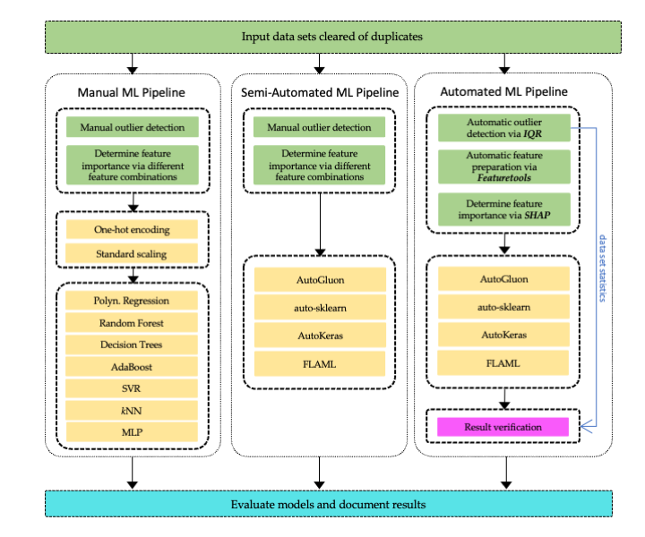

# End-to-End Implementation of Automated Price Forecasting Applications
The presented framework examins and compares different ML and AutoML methods for predicting the price for used construction machines. 
The data has been manually preprocessed for the manual and semi-automated ML pipelines and automatically preprocessed for the automated ML pipeline.

The following **ML methods** are integrated:

- Polynomial Regression
- Decision Trees
- Random Forests
- Adaptive boosting (AdaBoost)
- Support Vector Regression (SVR)
- k-Nearest Neighbors (kNN)
- Multi-Layer Perceptron (MLP) (Deep Learning)

The following **AutoML methods** are integrated:

- [Auto-sklearn](https://automl.github.io/auto-sklearn/master/index.html#)
- [AutoGluon](https://auto.gluon.ai/stable/index.html#)
- [FLAML](https://github.com/microsoft/FLAML)
- [AutoKeras](https://autokeras.com/)

The following tool have been used for automatic preprocessing:

- [Featuretools](https://www.featuretools.com/)
- [Shap](https://github.com/shap/shap)


## Grafical overview


<p align="center">
    
    <br>
</p>

The grafical overview illustrates the steps of the data processing phase in green, which are not part of the framework for the manual & semi-automated frameworks, and the ML phase in yellow. One-hot encoding and standard scaling are only applied to the manual ML pipeline.

## Requirements

Each AutoML framework plus the manual ML pipeline have their own conda environment.

Requirements for auto-sklearn:

- python
- auto-sklearn
- pandas, matplotlib, seaborn, numpy, yaml, python-docx

Requirements for FLAML:

- python
- FLAML
- pandas, matplotlib, seaborn, numpy, yaml, python-docx

Requirements for AutoGluon:

- python
- AutoGluon
- pandas, matplotlib, seaborn, numpy, yaml, python-docx 

Requirements for AutoKeras:

- python
- AutoKeras
- pandas, matplotlib, seaborn, numpy, yaml, python-docx 

Requirements for the manual ML Pipeline:

- python
- ML frameworks listed above
- pandas, matplotlib, seaborn, numpy, yaml, python-docx 

## Usage
The framework is implemented, tested and utilized on **Ubuntu Linux**. A small test implementation is available for MacOS.  

Execute

```bash
./control.sh 
```
to run the framework.

### Arguments

The execution can be controled via the following arguments, which can be modified within the control.sh file.

- **algorithms**: define the methods that should be executed
- **measurements**: set the number of repetitions
- **autosk\_time\_for\_task**: set the time\_left\_for\_this\_task auto-sklearn parameter
- **autosk\_runtime\_limit**: set the per\_run\_time\_limit auto-sklearn parameter
- **document\_results**: set this parameter to True to generate a docx document at the end of the execution

